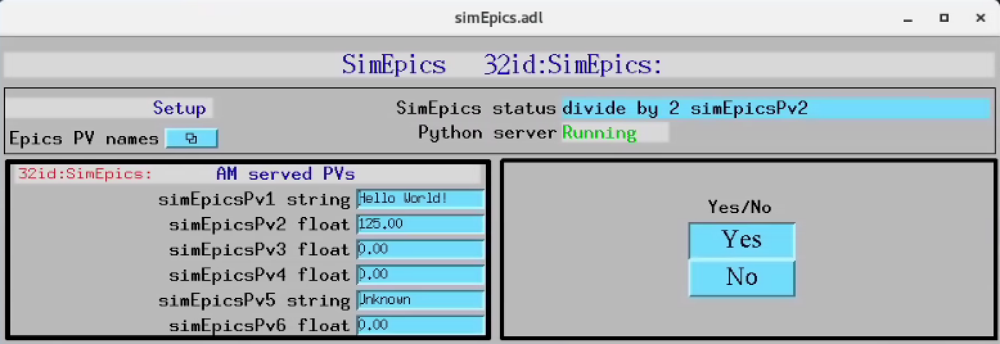

=============================
simEpicsApp EPICS application
=============================

.. 
   toctree::
   :hidden:

   amcntrols.template
   simepics_settings.req
   simepics.substitutions

simEpics includes a complete example of an EPICS application, consisting of:

- A database file and corresponding autosave request file that contain the PVs required by the simepics.py base class.
- OPI screens for medm
- An example IOC application that can be used to run the above databases.
  The databases are loaded in the IOC with the example substitutions file, 
  :doc:`simEpics.substitutions`.

Base class files
================
The following tables list all of the records in the simEpics.template file.
These records are used by the simepics base class and so are required.

simEpics.template
-------------------

This is the database file that contains only the PVs required by the amcontrol.py base class
:doc:`simEpics.template`.

Camera PV Prefixes
------------------

.. cssclass:: table-bordered table-striped table-hover
.. list-table::
  :header-rows: 1
  :widths: 5 5 90

  * - Record name
    - Record type
    - Description
  * - $(P)$(R)CameraPVPrefix
    - stringout
    - Contains the prefix for the detector, e.g. 2bmbSP2:

Example PV name
---------------

.. cssclass:: table-bordered table-striped table-hover
.. list-table::
  :header-rows: 1
  :widths: 5 5 90

  * - Record name
    - Record type
    - Description
  * - $(P)$(R)ExamplePVName
    - stringout
    - Contains a PV name, e.g. 32id:m1

AM served PVs
^^^^^^^^^^^^^

.. cssclass:: table-bordered table-striped table-hover
.. list-table::
  :header-rows: 1
  :widths: 5 5 90

  * - Record name
    - Record type
    - Description
  * - $(P)$(R)simEpicsPv1
    - stringout
    - Contains a string PV.
  * - $(P)$(R)simEpicsPv1
    - ao
    - Contains a float PV.
  * - $(P)$(R)simEpicsPv1
    - ao
    - Contains a float PV.
  * - $(P)$(R)simEpicsPv1
    - ao
    - Contains a float PV.
  * - $(P)$(R)simEpicsPv1
    - stringout
    - Contains a string PV.
  * - $(P)$(R)simEpicsPv1
    - stringout
    - Contains a string PV.

medm files
----------

simEpics.adl
^^^^^^^^^^^^^^

The following is the MEDM screen :download:`simEpics.adl <../../simEpicsApp/op/adl/simEpics.adl>` during a scan. 
The status information is updating.

simEpicsEPICS_PVs.adl
^^^^^^^^^^^^^^^^^^^^^^^

The following is the MEDM screen :download:`simEpicsEPICS_PVs.adl <../../simEpicsApp/op/adl/simEpicsEPICS_PVs.adl>`. 

If these PVs are changed simEpics must be restarted.

.. image:: img/simEpicsEPICS_PVs.png
    :width: 75%
    :align: center

