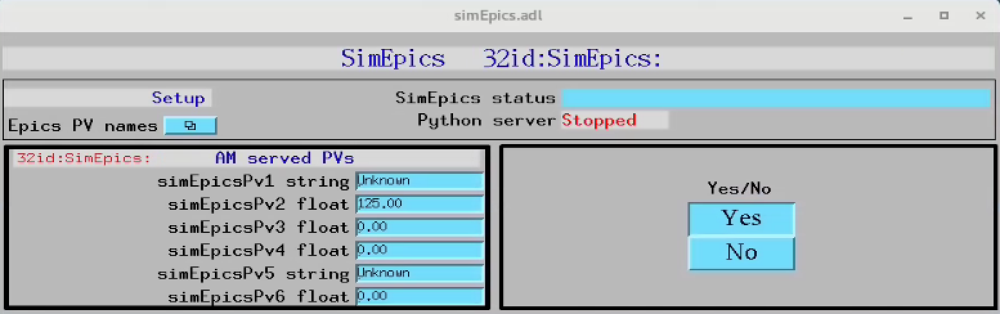
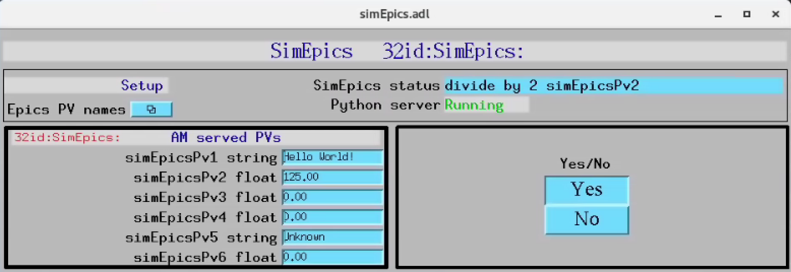

=====
Usage
=====

**simEpics** is a simple EPICS IOC to use as a template for creating EPICS PVs.  **simEpics** also provides callback support examples using python.

Start EPICS IOC
---------------

Edit ~/epics/synApps/support/simepics/configure to set EPICS_BASE to point to the location of EPICS base, i.e.:

::

    EPICS_BASE=/APSshare/epics/base-3.15.6

then start the **simEpics** epics ioc with:

::

    $ cd ~/epics/synApps/support/simepics/iocBoot/iocSimEpics
    $ start_IOC

Start MEDM screen
-----------------

::

    $ cd ~/epics/synApps/support/simepics/iocBoot/iocSimEpics
    $ start_medm

**simEpics** control screen with no python server running:

Start python server
-------------------

::

    $ bash
    (base) $ conda activate simepics
    (simepics) $ cd ~/epics/synApps/support/simepics/iocBoot/iocSimEpics
    (simepics) $ python -i start_simepics.py
	configPVS:
	CameraPVPrefix : 2bmbSP2:
	ExamplePVName : 32id:m1
	YesNoSelect : Yes
	simEpicsPv1 : Unknown
	simEpicsPv2 : 500.00
	simEpicsPv3 : 0
	simEpicsPv4 : 0
	simEpicsPv5 : Unknown
	simEpicsPv6 : 0

	controlPVS:
	Example : None
	SimEpicsStatus : divide by 2
	Watchdog : -2265

	pv_prefixes:
	Camera : 2bmbSP2:
	>>>

**simEpics** control screen with python server running:

Testing
-------

Pressing  Yes/No will run a callback that divide by 2 the value entered in the simEpicsPv2 field